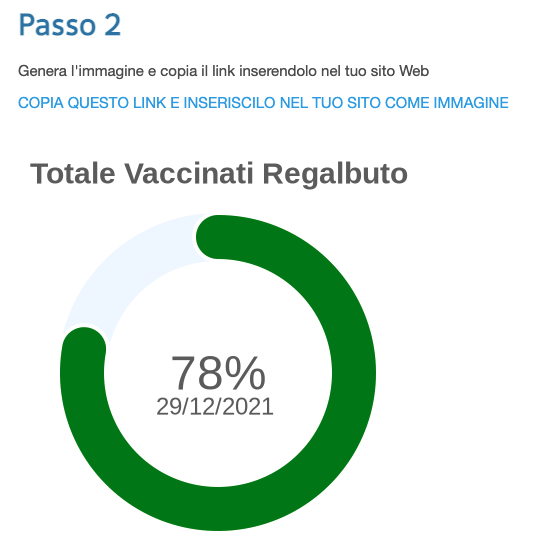

# MONIVAX - Monitora i vaccinati della tua città
<a href="https://www.datibenecomune.it/"></a> 


Generatore di widget come esempio di riutilizzo di OpenData per il monitoraggio delle vaccinazioni, a partire dai dati del progetto 
[Covid Open Report Sicilia](https://github.com/opendatasicilia/covid-open-report-sicilia).


## Installazione

```
composer install
```

### Demo
<a href="https://pirrotta.info/monivax" target="blank">Link</a>




### Strumenti
* [API del progetto Covid Open Report Sicilia](https://covid-open-report-sicilia.herokuapp.com/docs/)
* [API QuickChart.IO](https://quickchart.io/)

### Licenza
<a href="https://creativecommons.org/licenses/by/4.0/"></a>
